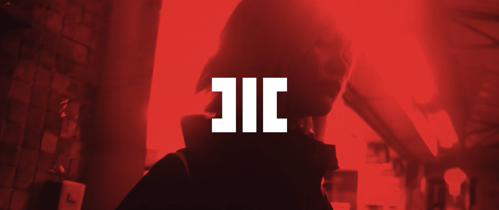

# HITECH CRIME UNIVERSE - "TRIBE" / SINGLE AV RELEASE

HC_SG_R01_TRIBE IS A "PILOT EPISODE" OF HITECH CRIME CINEMATIC UNIVERSE

**Enter the Universe now:** https://www.hitechcri.me/timeline/hc_sg_r01_tribe (link not active)

## RELEASE PROJECT DATA

'Tribe' is a first transmedia narrative chapter from the storyworld of Hitech Crime made by Helve AVR high technology agency. This marks the prototyping phase being actualized. Let the audiovisual experiments begin. This one relates close to my heart as it deals with the main overarching theme that has been present in my life - the notion of belonging to a tribe. Study on the feeling of loss, loyalty, discovery, selfrealization and mastery.

This story is a paraphrase of what I went through life. I was undermining myself by trying to fit in anywhere it was possible.
Metaphor of loyalty changes, selfdestructive blind behaviour as i couldn't cope with what i was feeling, mind games, betrayals, deception, real life.

This is going to be one song single + surrounding material.

**Release Title:** Tribe / **Featuring:** MOTHNODE

**Release Type:** Single / **Single Song Repo:** https://github.com/HITECHCRIME/HC_SG152_Tribe

**Production:**  / **Lyrics:** MOTHNODE

**Narrative Design:** Tim Moth

**Writing:** Tim Moth

## MAIN NARRATIVE

**Main Narrative**
Story based on lyrics of the single album release.

```
"With gold come knots tied on tight klout calls
For blood, sacrifice darkness to the rap gods
My tribe uses doubt and fear to conquer flaws"
```
```
With gold
```
- a job that gave the tribe a money stash, initial success theme, overwhelming feeling of power
```
come knots tied on tight
```
- having wealth always backfires / consumptionism / capitalism, feeling of loss
```
klout calls
```
- it makes people and their friends change usually for the worse if you don't know how to apply the power of wealth, people start making problems, loyalty theme
```
for blood
```
- own blood turns against blood of the tribe, people start making problems blinded with the prospect of benefits, betrayal, disappointment, mystery, violent delights, loyalty theme, wealth acquired disappears, blame is being assigned to the girl protagonist (seemingly for a reason, evidence is undeniable).
- death of a tribe member, girl protagonist the main character loves but at first doesn't realize she helped to conspire against him and the tribe to achieve benefits at cost of the others. she dies, he feels grief but discovers a clue that leads to discovery that she was having doubts about what is going on (their plan? someone external? nemesis of the story?) this and was being coerced into doing this along with the male protagonist. this begins the arc of revenge. 

Different perspective of the same story revealed through different platform (perspective of the girl):

- it in fact was the protagonist who mainly wanted to steal the stash, she and him were controlled remotely with an implant through a hacked Tribe's sign in form of a Photon Tattoo permalighted on skin (can be torn from flesh tho -> # -//-) and didn't know (blackouts), main character kills the girl he loved thinking he is trying to save the tribe, unknowingly being the trigger for the whole thing that started it all.

- Video short/animated as a part of the instagram release 9post: sensory scene - the dying girl, what she feels and hears in the audio comms as she is dying. Blue light from the street neons shines on her face. Vision distorts as she thinks "what did i do to deserve this?" (echoing voice in the video) not knowing it was her who instigated/helped with the incident "what's going on?" as she wakes up from a blackout and realizes that her life is in shreds. culmination - electric explosion - overloaded street generator with a rain of sparks hiting the pavement
```
sacrifice darkness to the rap gods
```
- downfall of morals and loyalty, need to express anger and resentment, learning to cope, lashing out
```
my tribe uses doubt and fear
```
- forced selfdiscovery
```
to conquer flaws
```
- which in the end turns out to be beneficial to the initially unaware. mastery theme

**FULL LYRICS TEXT**
```
hitech crime (electronic voice, glitch, 
GLADOS style but with darkness)
*whistling wind, some electronic noises of the street, 
like buzzing electricity from neons*

"learned a lesson, your turn"

HOOK (coming up)

With gold come knots tied on tight klout calls
For blood, sacrifice darkness to the rap gods
My tribe uses doubt and fear to conquer flaws 

CHORUS (drop)

With gold come knots tied on tight klout calls
For blood, sacrifice darkness to the rap gods
My tribe uses doubt and fear to conquer flaws 

INTERMISSION

Wounds
Reversed the costs at the speed of flow
aye

CHORUS

With gold come knots tied on tight klout calls
For blood, sacrifice darkness to the rap gods
My tribe uses doubt and fear to conquer flaws 

INTERMISSION

Fear(?) in the eyes of the public
When I drop the bombs with...

CHORUS (lower chilled scream)

With gold come knots tied on tight klout calls
For blood, sacrifice darkness to the rap gods
My tribe uses doubt and fear to conquer flaws 

VERSE

Landlines filled with blots
I slide off,  what everybody does,

....

anybody knows 
that I tend to search for costs
usually chunks of soul

CHORUS

With gold come knots tied on tight klout calls
For blood, sacrifice darkness to the rap gods
My tribe uses doubt and fear to conquer flaws 

blargh

OUTRO

*electric explosion - overloaded street generator with sparks 
hiting the pavement ;p not sure just yet, 
everything can be changed to fit a mutual vision*

///

With gold so thoughts bring the light from souls
For blood, sacrifice darkness to the rap gods
My tribe uses doubt and fear to conquer all 
```

- include a ping in the song that encourages listener to dive into the universe

## CONTENT CLOUD

**TIMELINE** - this particular arc of releases related to this storyline

**MAIN NODE** (unlock node by sharing with humans) - main piece of content that the whole story is derived from (single album release, cinematic narrative short film)

**SIDE NODES/MICRONODES** - different perspectives on the same story, filling in the missing fragments until the release of mystery - dopamine arcs

**CONTENT CLOUD** - associated types of content related to the release - see more examples below.

Entry points for the storyworld and the release. Sorted by release time.

**Leading Up Content (Dopamine Hook)**

- YouTube: MT_01 / Mystery Teaser 01 (twitter) part 1/2 -> go through socials to piece the message together
- YouTube: MT_02 / Mystery Teaser 02 (fb) part 2/2 -> go through socials to piece the message together
- Text Message Platform Signup for the Narrative - user receives ominous texts with "dopamine hooks" trying to draw them into the universe by mixing real life and fiction.

- "end of the material has ENTER THE UNIVERSE"

**Main Audiovisual Release**

- YouTube: HC_NSF25_Tribe / 'TRIBE' Cinematic Narrative Short Film set in the Hitech Crime Universe (the main narrative)
- YouTube: HC_SG152_Tribe / MOTHNODE_ Tribe | Cinematic Music Video / think about making it a VR/360 recorded video to be experienced in multiple ways.
Utilizes the scenes from the narrative short film but from a different perspective - we move among the slow-motion scenes with MOTHNODE culminating at the point where the street generator blows up and the girl dies. It acts as a final commentary on the events in the short story.
- YouTube: ?

Include websites like LOST did, but to have things that happen on the real internet affect what happens in the narrative universe - posts and events pop up in the narrative. A fictional project that interacts with the real audience in the story. One way medium no more. Things audience does online affects the storylines. Register various domains for fictional places and concepts.

- Fake Ad from the storyworld "Claim what's yours"
- Fake Ad from the storyworld "Photon Tattoo Parlour"
- Fake Ad from the storyworld "Future is here"
- Fake Website from the story: tribe's headquarters website with all sorts of info about the memebers and locations, plan details, expanding the depth of the setting
- Fake Website: photon tattoo parlour cyberspace access

**Release - actual commercial content for monetization/sale**

- PAID: Subscription to the whole universe (free access to everything) via hitechcri.me website
- PAID: Physical Single Release includes all the elements of the narrative (For Order + Limited Introductory Price Offer +  Goodies from the storyworld + Merch) via hitechcri.me website
- PAID: Digital Single Release (+ Goodies from the storyworld + Merch) via hitechcri.me website
- FREE: Hitech Crime Universe Timeline https://www.hitechcri.me/timeline/hc_sg_r01_tribe (link not active)
It’s important to have one platform where you control your music, content and brand image—your website. If a promoter or fan is searching for you online, the first hit they should get is your band website. This is your chance to hook them with a great first impression and win them over with an amazing user experience. Blow your own trumpet!
- PAID: Merchandise with physical and virtual things from the storyworld/timeline. Simple things? Patches with Hitech Crime logo or the tribe's logo -//-? T-shirts. Cinematic Posters - refer to Kannibal Wear Overview repo. Kannibal Wear would be the one who supplies the merch for Hitech Crime.

- FREE (monetized): Streaming Access: Spotify
- FREE (monetized): Streaming Access: Soundcloud https://soundcloud.com/mothnode/tribe
- FREE (monetized): Streaming Access: Apple Music/iTunes
- FREE (monetized): Streaming Access: YouTube Music
- FREE (monetized): Streaming Access: Amazon Music
- FREE (monetized): Streaming Access: Audiomack
- FREE (monetized): Streaming Access: Tidal
- FREE (monetized): Streaming Access: Pandora Radio
- FREE (monetized): Streaming Access: Slacker Radio
- PAID/FREE (monetized/Digital Version Sale): Streaming Access: Bandcamp
- FREE: Vimeo
- PAID/FREE: Google Play
- FREE: Reddit Music
- FREE: Music-related hashtags on @TwitterMusic
- FREE: Music-related hashtags on Instagram (not via main channel perhaps? so it doesn't clash with the 9post storyworld release)
- FREE: Spike on Last.fm
- FREE: Songkick (for live events)
- FREE: Bandsintown (for live events)
- FREE: Blogs as entry point (review or entry point designed with the blog to initiate people into the universe)
(Pitchfork, Stereogum, DatPiff and The A.V. Club)
- FREE: Music with Dozmia
- FREE: Insta 9grid/9post dopamine hook (with a bigger image - remember about the first frame of videos to match the full image)

1. Visual Atmospheric Still Image
2. Visual Atmospheric Still Image (Entry Point/Instructions)
3. Visual Atmospheric Still Image
4. Visual Atmospheric Snippet from the storyworld
5. Video: Music Video Teaser + Caption
6. Photo Carouselle (that swipes as one long image): Call to engage in the storyworld/ + Caption
input the sketch here
7. Video Post: trailer for the cinematic narrative short film "TRIBE"
8. Visual Atmospheric Still Image with Quote, make them interact with their phone 
9. Video Carousele: Glitchy Cinemgraphs of the Characters
(alternatively mix Video and Photo carousels to make a reveal of characters)

- FREE: IGTV uploads to @hitechcrime
- FREE: Instagram Stories (Instructions with a screenshot of the Instagram profile, watch the trailer for the cinematic narrative short film)
- FREE: Facebook Stories

- FREE (monetized via subs): Mixer Lead - Livestream Announcement Dopamine Hook (adds to mystery aspect)
- FREE (monetized via subs): Mixer - Music Video Livestream Premiere
- FREE (monetized via subs): Mixer - in-character storyworld livestream "Emergency Message Uplink Established_" - a message to the audience, asking for help
- FREE/PAID (monetized via subs + event tickets unless it would be a free reward for actually solving the puzzle): Mixer - Livestream in-character concert from an undisclosed location (or secret location which has to be discovered by the audience)

- FREE/PAID (tickets or earn your presence via fake cryptocurrency audience can gather through other activities related to the release): Physical art installation: tribe signs (street visual takeover according the the main core drive: visually hack the world)
- FREE: Use texting platform as the most intimate platform of breaching the 4th wall. 
```
/// NETWORK ERROR_ (glitched text message from the Hitech Crime future)
```
- PAID: Actual Physical Concert with hitech vibe (lasers, atmosphere, we transform the venue into a place from the short story) that has another set of clues for the audience to decypher.
x
x
x
x
x
x


- short story series (example Star Trek: Short Trek variations - tiny snippets from the universe 14 min)
- behind the scenes/making of (Helve Logs via Helve AVR Creative Ops)
- short web series narrative
- longform 'stick it together' version of the web series
- audio podcast version (audio-drama)
- interactive IRL storytelling exhibition (chapter)
- livestream narrative
- live event IRL (concert, semi-LARP)
- livestreams IRL Helve Logs
- FB dopamine hook
- virtual scenes (photogrammetric snapshot)
- game/VR render/experience
- real world guerilla reality hacking (also livestreamed)
- real world guerilla effect, experience the exposition -> universe content, photos, videos, character shots
- Agent Experience Logs_ outlet for fans who take part in the universe

- Alexa Narrative Experience (voice narrative, old radio shows)
- TikTok -> clues for puzzles for the audience (cryptic account)

- PRINT MATERIALS Books & magazines Flyers Posters Postcards Stickers Comic books
- DIGITAL CONTENT eBooks Website content Fan fiction Podcasts Video Video games
- DIRECT COMMUNICATIONS Text messages Chat or instant messages Email
- SOCIAL MEDIA Twitter Facebook Instagram Tumblr YouTube Fan sites and forums
- EXPERIENTIAL MEDIA Theater Concerts Exhibitions Live Installations Theme Parks Toys


 Futura tribe. Street Futura Aggrotrap
(Target: YouTube, Mixer Livestream Premiere, IGTV, Instagram 9pos
### Music Video

## Notes
